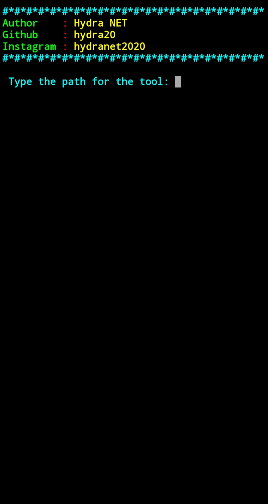

# enc
A tool that encrypts your tools in order to protect the source code

$ pkg update && upgrade -y

$ git clone https://github.com/hydra20/enc.git ; cd enc ; python2 encrypt.py

#www.youtube.com/c/hydranet2

